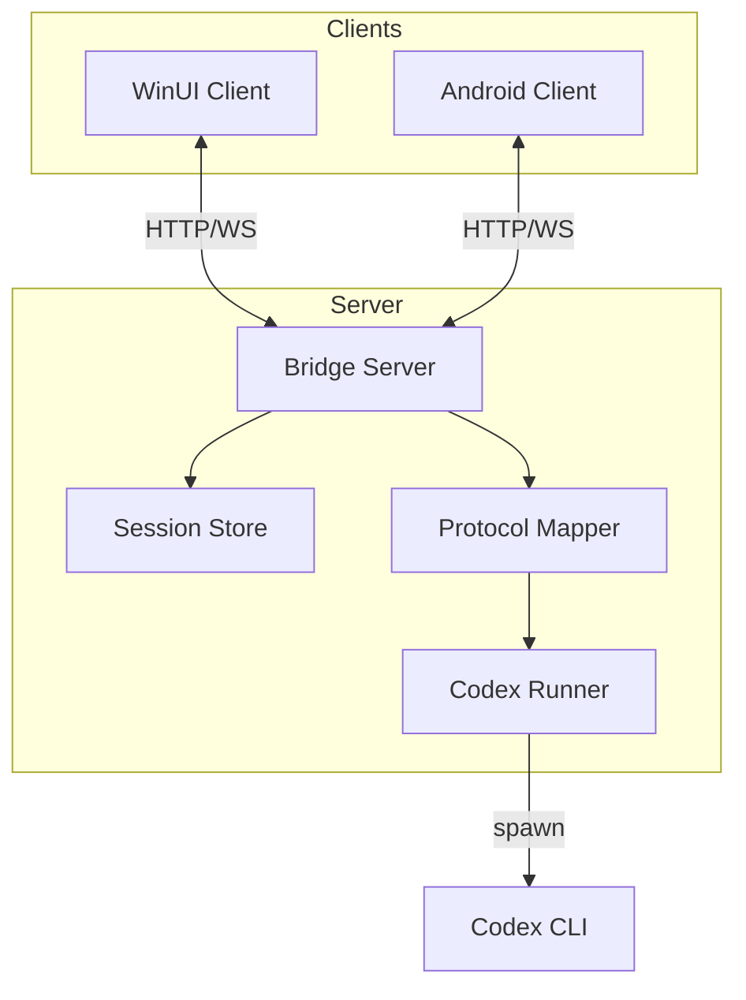

# 技术设计: Codex GUI Shell（WinUI3 + Bridge Server）

## 技术方案

### 核心技术
- **WinUI3:** 前端 UI（聊天/会话/diff/设置）
- **ASP.NET Core:** Bridge Server（HTTP + WebSocket）
- **Codex 集成:** 通过子进程调用 `codex exec --json`，解析 stdout JSONL 并转发事件
- **配置复用:** 直接使用用户已有 `~/.codex` 配置（不做复制/迁移）

### 实现要点
- **服务端为 SSOT:** 会话与运行状态由 Bridge Server 统一维护；多端只渲染与发送命令
- **事件流标准化:** 将 Codex JSONL 事件映射为稳定协议事件；同时保留透传通道便于调试
- **工作区隔离:** 每会话绑定工作区；运行时使用 `codex exec -C <workspace>`，并在服务端限制可选目录来源
- **模式切换映射:** UI 的权限模式/模型/思考深度映射到 `codex exec` 的 `--sandbox/--model/-c/--profile` 参数集合

## 架构设计

## 架构决策 ADR

### ADR-001: 采用 Bridge Server 作为多端同步中心
**上下文:** 需要 Windows/Android 同步同一会话的消息与流式输出，并预留远程访问能力。
**决策:** 引入独立 Bridge Server 统一会话/事件流，对外提供 HTTP/WS。
**理由:** 单点管理状态与安全边界；便于做多端同步、鉴权与远程开关；前端更轻。
**替代方案:** 前端各自直连 Codex CLI → 拒绝原因: 无法多端同步且难以复用会话与权限策略。
**影响:** 需要维护一个本机服务进程与协议版本化；但换来可扩展性与一致性。

### ADR-002: 通过 `codex exec --json` 驱动并解析 JSONL 事件
**上下文:** 需要稳定的流式输出与可解析事件，以便 GUI 渲染与多端同步。
**决策:** 服务端以子进程方式运行 `codex exec --json`，逐行读取 stdout 并解析为事件流。
**理由:** 命令行接口清晰；事件流天然适合 WS 转发；无需依赖 experimental 私有协议。
**替代方案:** 使用 `codex app-server` → 拒绝原因: 当前为 experimental 且运行形态/协议稳定性不确定。
**影响:** 需要实现进程生命周期管理、取消、超时与 JSONL 容错解析。

### ADR-003: 对外协议采用 WebSocket（JSON）+ HTTP（管理）
**上下文:** 需要在 WinUI/Android 间共享同一会话状态，并支持流式输出。
**决策:** HTTP 用于管理类接口；WS 用于命令与事件（强实时、可广播）。
**理由:** 各平台实现成本低；便于后续扩展与调试；流式天然适配 WS。
**替代方案:** gRPC → 拒绝原因: 引入 HTTP/2 与工具链复杂度，且对调试与跨端迭代不如 JSON 直观。
**影响:** 需要定义协议版本与兼容策略（例如 `protocolVersion` 字段）。

### ADR-004: 远程访问默认关闭，显式开启并使用强令牌
**上下文:** 远程访问等同远程驱动本机 `codex` 能力，风险高。
**决策:** 默认仅绑定 `127.0.0.1`；启用远程需用户显式开启，并配置/生成 Bearer Token；公网建议 TLS。
**理由:** 最小惊扰与最小暴露；符合“默认安全”。
**替代方案:** 默认监听 0.0.0.0 无认证 → 拒绝原因: 高风险。
**影响:** 需要在设置页提供清晰的风险提示、配对流程与重置令牌能力。

## API 设计

### HTTP（建议）
- `GET /api/v1/health`
- `GET /api/v1/workspaces`
- `POST /api/v1/workspaces/select`
- `GET /api/v1/sessions`
- `POST /api/v1/sessions`

### WebSocket（建议）
- `WS /ws`
  - command: `chat.send` / `run.cancel` / `session.rename` / `settings.update`
  - event: `run.event`（流式）/ `run.completed` / `session.updated` / `diff.updated`

## 数据模型

MVP 建议以 JSON 存储：
- `sessions.json`：会话索引（含 `codexSessionId`）
- `settings.json`：远程开关、令牌（令牌建议存系统安全存储或加密后落盘）

## 安全与性能

- **绑定策略:** 默认 `127.0.0.1`；开启远程时可选 `0.0.0.0`/指定网卡
- **鉴权:** Bearer Token；连接 WS 前先鉴权；令牌可轮换
- **资源限制:** 限制并发运行数、单条消息大小、超时与取消；避免输出无限缓存
- **权限继承:** Bridge Server 以当前用户运行，`codex exec` 权限由同用户与 Codex sandbox/配置决定

## 测试与部署

- **测试:** 后端解析器单测；HTTP/WS 集成测试（含多客户端同步）
- **部署:** WinUI 启动时拉起后端子进程；支持独立启动便于 Android 连接

