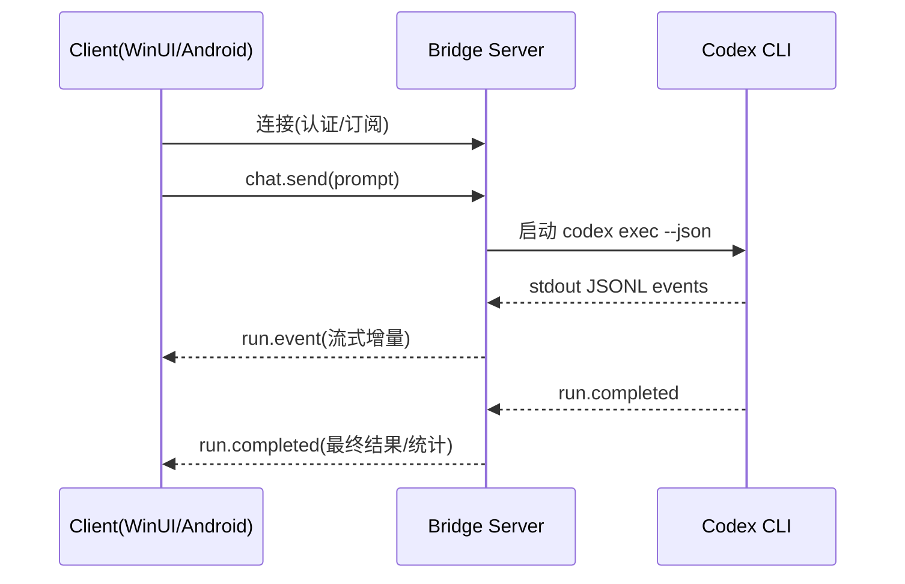

# 架构设计

## 总体架构

```mermaid
flowchart LR
    Win[WinUI Client] <-->|HTTP/WS(JSON)| Svc[Bridge Server]
    And[Android Client] <-->|HTTP/WS(JSON)| Svc
    Svc -->|spawn| Codex[Codex CLI: codex exec --json]
    Codex -->|JSONL events| Svc
    Svc -->|读写| WS[(Workspace/Git)]
    Svc -->|读取| Cfg[(~/.codex)]
    Svc -->|本地持久化| Store[(Session Store)]
```

## 技术栈
- **后端:** .NET 8 / ASP.NET Core
- **前端:** WinUI 3（Windows App SDK）
- **协议:** WebSocket（全双工）+ HTTP（管理类接口）
- **与 Codex 集成:** `codex exec --json` 事件流（JSONL）
- **安全默认:** 仅回环访问；开启远程需 Bearer Token（建议公网使用 TLS）

## 核心流程



## 重大架构决策

完整的 ADR 存储在各变更的 `how.md` 中，本章节提供索引。

| adr_id | title | date | status | affected_modules | details |
|--------|-------|------|--------|------------------|---------|
| ADR-001 | 采用 Bridge Server 作为多端同步中心 | 2026-01-17 | ✅已采纳 | Bridge Server, Protocol | [how.md](../history/2026-01/202601172220_codex_gui_shell/how.md) |
| ADR-002 | 通过 `codex exec --json` 驱动并解析 JSONL 事件 | 2026-01-17 | ✅已采纳 | Bridge Server | [how.md](../history/2026-01/202601172220_codex_gui_shell/how.md) |
| ADR-003 | 对外协议采用 WebSocket（JSON）+ HTTP（管理） | 2026-01-17 | ✅已采纳 | Protocol, Bridge Server | [how.md](../history/2026-01/202601172220_codex_gui_shell/how.md) |
| ADR-004 | 远程访问默认关闭，显式开启并使用强令牌 | 2026-01-17 | ✅已采纳 | Bridge Server | [how.md](../history/2026-01/202601172220_codex_gui_shell/how.md) |
